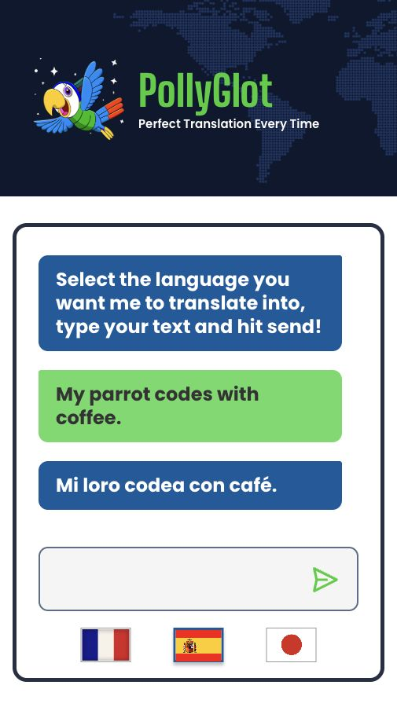

# PollyGlot

PollyGlot is a small AI-powered translation chat app built as an OpenAI API integration project. It lets a user choose a target language, enter text, and receive a translated response in a styled chat interface.

The app keeps API credentials on the server and adds strict request limits around the public translation endpoint.

## Preview



## What It Does

- Translates user text into French, Spanish, or Japanese.
- Corrects obvious spelling and grammar issues before translating.
- Preserves the user's intended meaning, tone, punctuation, formatting, and emoji usage.
- Displays the conversation in a chat-style UI.
- Keeps API credentials on the server instead of exposing them in the browser.
- Uses a responsive layout with vertical-only scrolling and wrapping message bubbles.

## Tech Stack

- React
- Vite
- Tailwind CSS
- Express
- OpenAI Responses API

## Project Structure

```text
PollyGlot/
|-- client/              # React + Vite frontend
|-- server/              # Express API server
|-- docs/screenshots/    # README preview assets
`-- README.md
```

## Local Setup

Clone the repository, then install dependencies and build from the repo root:

```bash
npm install
npm run build
```

Create a `.env` file inside `server/`:

```bash
OPENAI_API_KEY=your_api_key
OPENAI_URL=your_openai_compatible_base_url
OPENAI_MODEL=your_model_name
PORT=3000

# Optional strict public-use controls
ALLOWED_ORIGINS=https://your-render-service.onrender.com
MAX_INPUT_CHARS=400
RATE_LIMIT_MAX=5
RATE_LIMIT_WINDOW_MS=900000
DAILY_TRANSLATION_LIMIT=30
OPENAI_MAX_OUTPUT_TOKENS=300
OPENAI_REASONING_EFFORT=minimal
```

Start the app:

```bash
npm start
```

Then open:

```text
http://localhost:3000/
```

For frontend development with Vite, run the client in a second terminal:

```bash
npm run dev --prefix client
```

## Scripts

Root:

```bash
npm run build
npm start
```

Frontend:

```bash
npm run dev --prefix client
npm run lint --prefix client
```

## Notes

For Render, deploy this repository as one Node web service from the repository root:

```text
Build Command: npm run build
Start Command: npm start
```

Set the OpenAI environment variables in Render, and keep the strict limit variables low for public demos.
